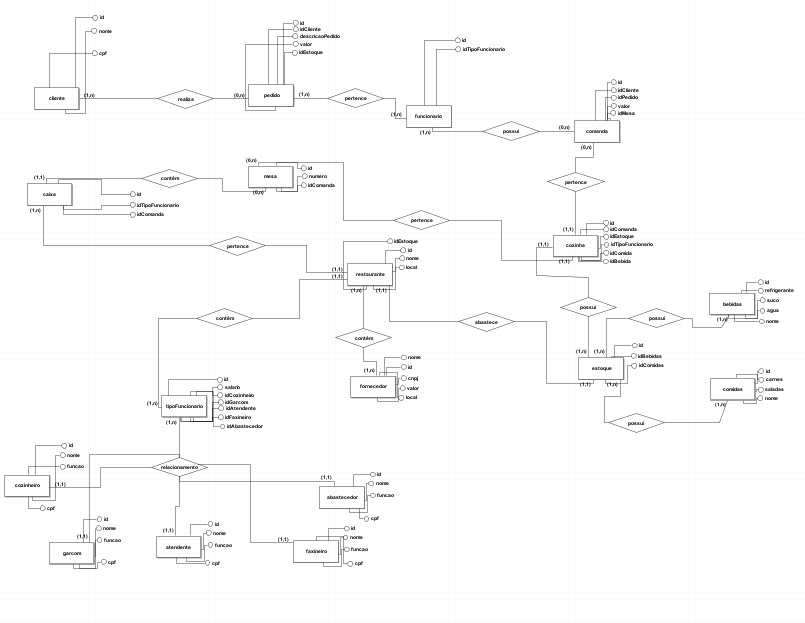
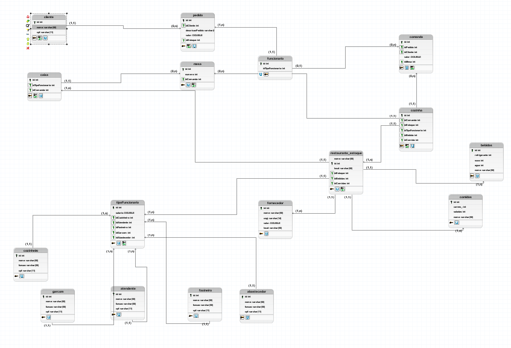

<h1 align="center">
 
Restaurant diagrams
</h1>

This is progect is based in restaurant for create a diagrams/models: conceptual, logical and physical

  

[//]: # (Add your gifs/images here:)

  <h1 aling="center">
     
    Diagram Conceptual
    </h1>
  
  
    <h1 aling="center">
     
    Diagram Logical
    </h1>
  
  
      <h1 aling="center">
     
    Diagram Physical
    </h1>

## Built with
[//]: # (Add the features of your project here:)

-  HTML
-  HTML

## License

This project is licensed under the MIT License - see the [LICENSE](https://opensource.org/licenses/MIT) page for details.
